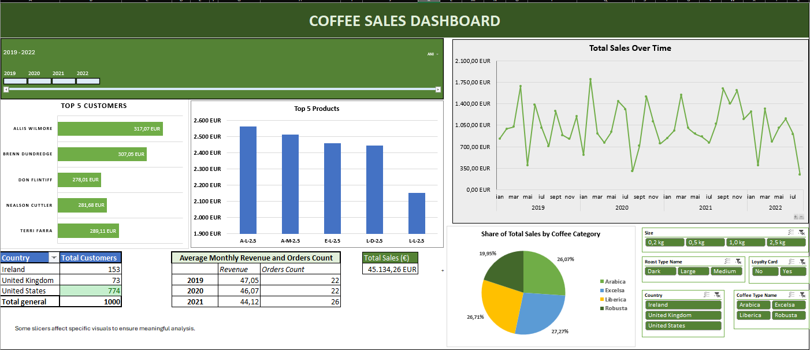

# Coffee Sales Dashboard

The purpose of this Excel project is to answer common business questions in the sales industry, such as identifying top-selling products, understanding costumor behavior and analyzing revenue trends over time.

## Table of Contents
- [Project Overview](#1-project-overview)
- [Tools](#2-tools-used)
- [Business-Oriented Selective Slicer Logic](#3-business-oriented-selective-slicer-logic)
- [Key Insights and Recommendations](#4-key-insights-and-recommendations)

#### 1. Project Overview

The initial inspiration for the dashboard layout was taken from this [Youtube tutorial](https://youtu.be/m13o5aqeCbM?si=tKZYX2PPAnuT1joh), however the final dashboard was significantly customized by adding new slicers, pivot charts, KPIs and calculations. The datasat represents the dataset represents coffee beans sales of 3 years and 8 months (2019-2022 august) and it was provided by the tutorial author. It contains 3 different sheets:

- A main sheet with 1000 orders
- A customer informations sheet
- A product information sheet.

The final dataset for analysis was created in Orders my merging data from the other 2 tables, using powerful Excel functions such as XLOOKUP and INDEX/MATCH. Additional data cleaning and formatting steps were performed to ensure data consistency and accuracy before building a clear and well-organized dashboard.

> All insights, interpretations, and business recommendations presented in this project were independently developed based on my own analysis of the data.

### 2. Tools Used

- **Pivot Tables** - for summarizing the dataset efficiently and uncovering patterns. For example, a pivot table analyzed how monthly average revenue evolved over time.

- **Pivot Charts** - to visually communicate insights, such as a line chart illustrating sales trend across the evaluated time period.
- **Slicers** - to enchance interactivity, applied only to relevant visuals as explained below in order to ensure a consistent and coehisive analysis.

<table align="center" border="1" cellspacing="0" cellpadding="5">
  <tr>
    <td>
      
    </td>
    <td>
      
    </td>
  </tr>
</table>

### 3. Business-Oriented Selective Slicer Logic
To maintain analytical relevance, the slicers were intentionally connected only to visuals where they provide meaningful insights:
1. The **Size slicer** is connected to the *Top 5 Products* and *Share of Total Sales by Coffee Category* charts to evaluate how product size influences purchasing behaviour.
2. The **Roast Type** and **Coffee Type** slicers are applied to the *Top 5 Products*, *Top Customers* and *Sales Trend* visuals, supporting the analysis of customer preferences, behavioral patterns, and potential seasonality.
3. The **Loyalty Card** slicer is linked to *Top 5 Customers* and *Total Customers by Country* charts to assess loyalty-driven purchasing behaviour.
4. The **Country** slicer filters all the charts, enabling comparative evaluation across global markets.

### 4. Key Insights and Recommendations
- **77% of customers** are located in **U.S.**, indicating a strong dependency on a single market.
- **Sales trends show significant fluctuations during the pandemic**, with an overall upward trend that **peaked in Fall 2021**, followed by a noticeable decline.
- **Total sales** for the analyzed period amount to approximately **€41K**, with three coffee categories contributing almost equally, while **Robusta underperforms** and may **require further investigation**.
- **Arabica coffee** (2.5 kg, Large size) stands out as the **best-selling product**, generating over €2,000, whereas **0.2 kg packages** generate **minimal revenue** (<€500) and could be considered for discontinuation.
- The **UK market** requires strategic intervention, shows a **critical decline** with **sales dropping by over 80%** in March 2022 compared to March 2019.
- **Seasonality** is evident in **Liberica sales**, with a consistent increase from late September to March, suggesting **strong winter demand**.
- Strong **regional taste preferences** are observed in the **European markets**, with a high demand for **Liberica and Excelsa**, which together account for over 55% of total European revenue.
