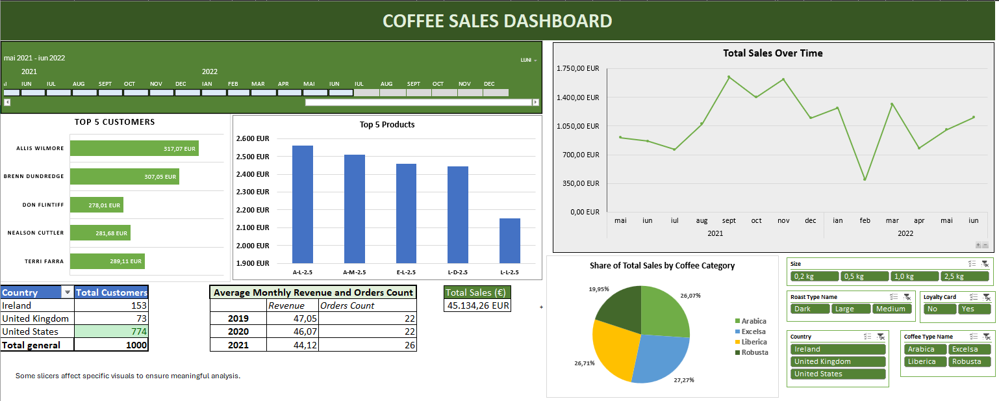
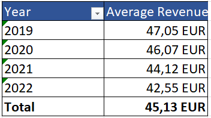
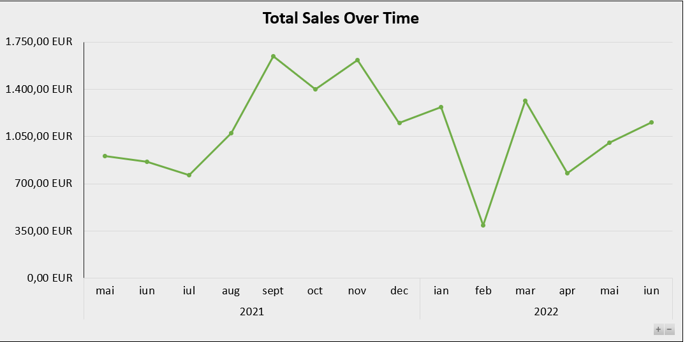

# Coffee Sales Dashboard

The purpose of this Excel project is to answer common business questions in the sales industry, such as identifying top-selling products, understanding costumor behavior and analyzing revenue trends over time.

## Table of Contents
- [Project Overview](#1-project-overview)
- [Tools](#2-tools)
- [Business-Oriented Selective Slicer Logic](#3-project-components-and-personal-contributions)
- [Key Insights & Recommendations](#4-conclusions-and-business-recommendations)

#### 1. Project Overview

The initial inspiration for the dashboard layout was taken from this [Youtube tutorial](https://youtu.be/m13o5aqeCbM?si=tKZYX2PPAnuT1joh), however the final dashboard was significantly customized by adding new slicers, pivot charts, KPIs and calculations. The datasat represents the dataset represents coffee beans sales of 3 years and 8 months (2019-2022 august) and it was provided by the tutorial author. It contains 3 different sheets:

- A main sheet with 1000 orders
- A customer informations sheet
- A product information sheet.

The final dataset for analysis was created in Orders my merging data from the other 2 tables, using powerful Excel functions such as XLOOKUP and INDEX/MATCH. Additional data cleaning and formatting steps were performed to ensure data consistency and accuracy before building a clear and well-organized dashboard.

### 2. Tools Used

- **Pivot Tables** - for summarizing the dataset efficiently and uncovering patterns. For example, a pivot table analyzed how monthly average revenue evolved over time.

- **Pivot Charts** - to visually communicate insights, such as a line chart illustrating sales trend across the evaluated time period.
- **Slicers** - to enchance interactivity, applied only to relevant visuals as explained below in order to ensure a consistent and meaningful analysis.

   

